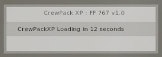

# Flight Factor Boeing 757 / 767

## Quick Points
- Automatically selects the EHSI to map mode and displays 10 nm range with TFC on initialisaiton. If engines are shutdown the GPU will be brought online.
- Full takeoff calls by both crew, based on the FMS speed entreies, automatic VNAV engagement if not already armed at the acceleration height in FMS takeoff ref page 2.
- Automatic selection of transponder to TA/RA when passing 80kts, if not already turned on.
- Localiser and glide slope calls, which will reset once the loc signal has full scale deflection. Some nusiance calls may be made if the ILS frequency is left tuned in other stages of flight.
- Landing speedbrake calls.
- Go around calls with PNF actively managing aircraft configuration. When pressing the TOGA clickspot on the MCP, the PNF will select flaps 20, select the gear up,   attempt to engage LNAV at 400ft AGL, select climb thrust at the acceleration height, attempt to engage VNAV or FLCH at Flap 0 speed if there is no valid VNAV path.
- After shutdown, the ground crew will connect the GPU, open L1, fwd/aft cargo doors and bring the belt loaders to the aircraft.


---
## Status HUD
The status HUD is located on the left side of the screen by default. It will auto hide when the mouse is not in teh vicinity of the HUD. 

### Explination
> 
>
> 1. Title of the loaded aircraft script and version number. Doubles as a hidden click spot to open the aircraft settings.
> 2. Trigger point to run the FO Preflight setup routine.
> 3. -- Not Yet Implemented --
> 4. Status bar which indicates if the TO Callout mode is armed and the current detected vspeeds.  

If the status HUD is moused over during initialisation, it will indicate how long until CrewPackXP is useable.
> 
 
### Moving the Status HUD
The position of the Status HUD can not be adjusted within the X-Plane environemnte. 
It can, however, be adjusted within each aircraft scripts code.

To adjust the code, open the `CrewPackXP_FF767.lua` file with a text editor and look for the following section on lines 44-46.

```lua
44   -- Settings Window Position
45   local intHudXStart = 15
46   local intHudYStart = 475
```
The `intHudXStart` variable controlls the position of the HUD horizontally on the screen in pixels. `0` being the far left of the screen.  
The `intHudYStart` variable controlls the position of the HUD vertically on the screen in pixels. `0` being the bottom of the screen.  

#### Example
If another X-Plane plugin is occupying the same space and you wish to move the HUD further up the screen:
 - `intHudXStart` can remain the same at `15`;
 - `intHudYStart` can be increased to a higher value. With a monitor resolution of 2560 x 1440, the top of the screen would be 1440 pixels. So the current `475` can be changed to `1200` to keep it from overlapping with the X-Plane internal menu.

 The code would be adjusted to:

```lua
44   -- Settings Window Position
45   local intHudXStart = 15
46   local intHudYStart = 1200
```
---
