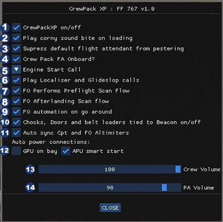
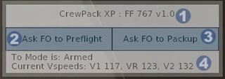

# Flight Factor Boeing 757 / 767

## Quick Points
- Full takeoff calls by both crew, based on the FMS speed entries, automatic VNAV engagement if not already armed at the acceleration height in FMS takeoff ref page 2.
- Automatic selection of transponder to TA/RA when passing 80kts, if not already turned on.
- Localiser and glideslope calls.
- Landing speed brake call.
- Go around calls with PNF actively managing aircraft configuration. When pressing the TOGA click spot on the MCP, the PNF will select flaps 20, select the gear up,   attempt to engage LNAV at 400ft AGL, select climb thrust at the acceleration height, attempt to engage VNAV or FLCH at Flap 0 speed if there is no valid VNAV path.
- After shutdown, the ground crew will connect the GPU, open L1, fwd/aft cargo doors, and bring the belt loaders to the aircraft.
---

## Aircraft Settings
The aircraft settings window can be accessed via two methods.  
1. Hidden click spot in the title of the Status HUD  
2. Via the X-Plane menu bar system by navigating:  
   > Plugins > FlyWithLua > FlyWithLua Macros > CrewPack XP Settings   

<br>

>   
> 
> 1. 'Master Switch' - disables CrewPackXP for the loaded aircraft.  
> 2. CrewPackXP PA's associated with the flight attendant.  
> 3. Once the script has been initialised, a short and very tacky sound bite will play as confirmation.  
> 4. Enables the `Localiser Alive` and `Glideslope Alive` calls from the First Officer.  
> 5. The First Officer will automatically perform the pre-flight scan flow once the script has initialised.  
> 6. Completely suppresses the default Flight Factor Flight Attendant.  
> 7. When entering TOGA, the FO will automatically help reconfigure the aircraft.  
> 8. With the beacon and engines off, Ground Service Equipment will automatically be called to the aircraft.  
> 9. Dropdown menu to select between `Starting Number 1` or `Starting Left Engine` format for the voice call associated with engine start.  
> 10. Automatically synchronizes the First Officer Altimeter with the setting on the captain's side every few seconds.  
> 11. Indicates preference for either GPU or APU to be used during turnarounds, or both.  
> 12. Volume slider to control the cockpit crew callouts  
> 13. Volume slider to control the flight attendant making PAs in the cabin.  


---
## Status HUD
The status HUD is located on the left side of the screen by default. It will auto-hide when the mouse is not in the vicinity of the HUD. 

> 
>
> 1. Title of the loaded aircraft script and version number. Doubles as a hidden click spot to open the aircraft settings.
> 2. Trigger point to run the FO Pre-flight setup routine.
> 3. -- Not Yet Implemented --
> 4. The status bar indicates if the TO Callout mode is armed and the current detected vspeeds.  

If the status HUD is moused over during initialisation, it will indicate how long until CrewPackXP is useable.
> 

Once the Beacon is turned on, the FO commands will become inoperable.
> 
 
### Moving the Status HUD
The position of the Status HUD can not be adjusted within the X-Plane environment.  
It can, however, be adjusted within each aircraft script's code.  

To adjust the code, open the `CrewPackXP_FF767.lua` file with a text editor and look for the following section on lines 44-46.

```lua
44   -- Status HUD Position
45   local intHudXStart = 15
46   local intHudYStart = 475
```
The `intHudXStart` variable controls the position of the HUD horizontally on the screen in pixels. 0 is the far left of the screen.  

The `intHudYStart` variable controls the position of the HUD vertically on the screen in pixels. 0 is the bottom of the screen.  

#### Example
If another X-Plane plugin is occupying the same space and you wish to move the HUD further up the screen:  
 - `intHudXStart` can remain the same at 15;  
 - `intHudYStart` can be increased to a higher value. With a monitor resolution of 2560 x 1440, the top of the screen would be 1440 pixels. So the current 475 can be changed to 1200 to keep it from overlapping with the X-Plane internal menu.  

 The code would be adjusted to:

```lua
44   -- Status HUD Position
45   local intHudXStart = 15
46   local intHudYStart = 1200
```
---
## Event Triggers
  
### FO Pre-Flight
The First Officer pre-flight scan flow can be called from either the Status HUD, or automatically via the aircraft settings.

The First Officer will attempt to do the following:
> - Stow the seat arm-rests;
> - Lightly turn on the cockpit and instrument lighting;
> - Set the classic EFIS screens to display traffic in range mode and 10nm;
> - Set the new style EFIS screens to display traffic;
> - Set up the electrical panel, turning on either the GPU or APU as selected in aircraft settings;
> - Set up the Hydraulic panel;
> - Set up the air conditioning panel;
> - Set the pressurisation panel to current altitude;
> - Bring up both CDU's to the INIT page.

> The Flight Attendants will attempt to open all of the cabin blinds;
> The ground crew will perform their respective duties as per the ` GSE with Beacon` section of the manual.

### GSE with Beacon
The beacon light is used as the main trigger for the ground crew. However, they will not approach if either engine is above 25% N2. On arrival after a flight, the lead ground handler will make contact with the flight deck via the interphone to inform them that the chocks are in place. This is inhibited until after the gear has been raised on takeoff. All ground equipment used is the default flight factor model.

The ground crew will perform the following actions:
> - Connect the GPU if this is enabled in the aircraft settings;
> - Open the main cabin door;
> - Position the baggage unloading equipment;
> - Set the nose wheel chocks;
> - Park the fuel truck in position;
> - Configure the Flight Factor tablet to the 'gate' setting.

The ground equipment will be removed by selecting the beacon to on. As a consequence of this, should the need arise to start the aircraft with an unserviceable APU, the start must be completed with the GPU prior to selecting the beacon on.

### Flight Attendant Interactions
The flight attendant will act autonomously throughout the flight. There are no direct interactions with Tanya, however, she will make PAs based upon noticeable events. This is realistic behavior in the real world.

The following PAs can be expected from Tanya:
> | Trigger | Callout |
> | --- | --- |
> | Beacon On and Right engine N2 reaches 10%, or aircraft has a positive ground speed| Welcomes the passengers onboard the flight |
> | A few minutes after the welcome announcement | Cabin Safety Demonstration |
> | A few minutes after the Cabin Safety Demo | Contacts the flight deck to announce the cabin is ready for takeoff |
> | 757/767 System reports FMS has entered descent mode | Top Of Descent announcement |
> | Seatbelt sign is selected ON | PA to prepare the cabin for landing |
> | Gear selected down | PA to instruct cabin crew to be seated |
> | Speed reduces below 30 kts on landing | Welcome to destination PA |

### Cockpit Callouts
All crew callouts have a time based callout logic to prevent two simultaneous callouts. Occasionally this may result in the second callout being slightly delayed. As an example: "V1, Rotate" may blend into a single continuous callout, which will cause "Rotate" specifically to lag the actual speed.

#### Takeoff
In order to suppress unwanted callouts, CrewPackXP will attempt to identify the aircraft thrust reference mode to arm the takeoff callouts. TO, TO1, and TO2 are all recognized as the trigger, and will typically be autoselected by the 757/767 systems on the ground. The Status HUD provides confirmation that the CrewPackXP takeoff mode is armed.

The speeds used for the respective callouts is reported directly from the 757/767 systems. The Status HUD provides confirmation of what vspeeds it has detected.

During takeoff the following calls can be expected:
> | Trigger | Callout | Acknowledgement |
> | --- | --- | --- |
> | Passing 80 kts | "80 Knotts" | "Checked" |
> | V1 +/- 3 kts | "Vee One" | - |
> | Vr +/- 3 kts | "Rotate" | - |
> | Climb Rate and wheels have left ground | "Positive Rate" | - |
> | Passing FMS Acceleration Height | "Vee-Nav" | engages VNAV |

#### Aircraft Configuration
##### Flaps
Callouts are provided for all stages of flap selection.  
The callout will occur after the flap lever has been in a new flap position detent for 1 second.  
Flap callouts are inhibited on the ground.

##### Gear
Callouts are provided for gear selection. This is triggered when the gear handle is moved into either the up or down position.

The gear movement is also responsible for resetting many functions within CrewPackXP. This enables it to suppress callouts that may occur during takeoff or landing as appropriate.
The following actions are dependent on the gear:  
Gear Selected UP:  
> - Resets the landing callouts logic;
> - Resets the logic responsible for turning on the APU after landing (if APU is selected in Aircraft Settings);
> - Resets the lead ground handler to set chocks and contact the flight deck on arrival at the gate;
> - Resets flight attendants landing PA and Seatbelts on PA;
> - Automatically selects the nose gear light to OFF.
  
Gear Selected DOWN:  
> - Resets the positive rate call for a potential Go-Around
> - Rests the logic that looks for a Go-Around signal
> - Automatically selects the nose gear landing light to ON.

#### Localiser and Glide Slope
Callouts will be made once there is movement detected on the CDI for both localiser and glide slope indications. The glide slope callout can not be made until after the localiser callout.
Both are reset once the aircraft moves beyond 2.5 degrees of the selected course, which is full scale deflection on the CDI.  

In order to minimize nuisance callouts, it would be best to reset the ILS radio after landing to prevent it from triggering on departure.

#### Landing Callouts
The callouts on landing are inhibited until after a gear cycle has been completed. i.e. the gear has been selected up, and reselected back down. 

The following callouts can be expected:
> | Trigger | Callout | Acknowledgement |
> | --- | --- | --- |
> | Speed brake is deployed after touchdown | "Speed brake is up" | - |
> | Speed brake is not deployed after touchdown | "Speed brake not up" | - |
> | Decelarting through 60 kts | "60 Knotts" | - |

If APU option is selected in the aircraft settings, the first officer will select it to start once the aircraft has decelerated through 30 Knotts. At this point the takeoff calls will all be reset ready for the next departure.

#### Go-Around / Missed Aproach
An option is provided in the aircraft settings to have the First Officer assist in the event of a go-around. These actions are triggered by the 757/767 entering TOGA mode. The Go-Around functions will be reset when the gear is next selected down.

The following actions will occur during a go-around:
> | Trigger | Action | Callout |
> | --- | --- | --- |
> | TOGA being engaged | Automatic selection of Flaps 20 | "Flaps 20" |
> | Climb rate increases above 100 ft / min | Automatic selection of the gear up | "Positive rate, gear up" |
> | Reaching 400 ft AGL | Automatic selection of LNAV | "LNAV" |
> | Reaching the FMS acceleration height | Automatic selection of climb thrust | "Climb Thrust" |
> | After climb thrust is selected | Automatic selection of VNAV | "VNAV" |
> | If VNAV has failed to engage | Selection of FLCH at a speed of vref30 + 80 kts |

---
## Final Thoughts
A final acknowledgement for the inspiration on the tacky audio bytes that are contained within the 757 / 767 experience.  
- Zibo Mod: General inspiration to attempt such a feat with my crappy coding skills.  
- Airplane: You should never stop in the red zone, that is for loading and unloading only.  
- Living the Dream: Why do they always have to touch the screens??? It annoys me too.  
- The Simpsons: Boy camp Krusty does sound like fun.  
- Brewstew 13 o'clock news: Tanya the dalmatian, because everyone knows a Tanya.  
