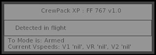
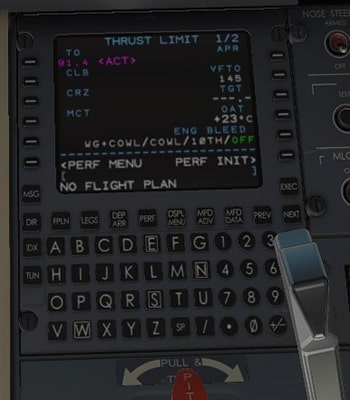
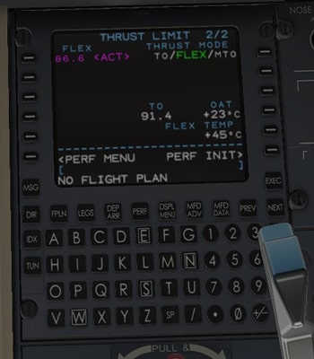
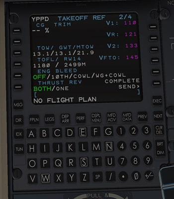

# Hot Start Challenger 650:

## Quick Points
- Takeoff calls by both crew based on the Speed entries from the CDU.  
- FLCH and Climb Thrust selection during initial climb.  
- Localiser and Glide Slope Calls if the APPR mode is armed.  
- Landing reverse calls  
- 1'000 ft to go on altitude captures.  
- FO can now preflight the aircraft if selected in the settings.  
---
## Aircraft Settings
The aircraft settings window can be accessed via two methods.  
1. Hidden click spot in the title of the Status HUD  
2. Via the X-Plane menu bar system by navigating:  
   > Plugins > FlyWithLua > FlyWithLua Macros > CrewPack XP Settings  

<br>

> 
>
> 1. 'Master Switch' - disables CrewPackXP for the loaded aircraft.  
> 2. Once the script has been initialised, a short and very tacky sound bite will play as confirmation.  
> 3. Dropdown menu to select between `Starting Number 1` or `Starting Left Engine` format for the voice call associated with engine start.  
> 4. Enables the `Localiser Alive` and `Glideslope Alive` calls from the First Officer.  
> 5. Automatically selects FLCH during takeoff through 400 ft.  
> 6. The First Officer will automatically perform the pre-flight scan flow once the script has initialised.  
> 7. Volume slider to control the cockpit crew callouts  

---
## Status HUD
The status HUD is located on the left side of the screen by default. It will auto hide when the mouse is not in the vicinity of the HUD. 

>
>
> 1. Title of the loaded aircraft script and version number. Doubles as a hidden click spot to open the aircraft settings.  
> 2. Trigger point to run the FO Preflight setup routine.  
> 3. -- Not Yet Implemented --
> 4. The status bar indicates if the TO Callout mode is armed and the current detected vspeeds.    

If the status HUD is moused over during initialisation, it will indicate how long until CrewPackXP is useable.
> 

Once the Beacon is turned on, the FO commands will become inoperable.
> 

### Moving the Status HUD
The position of the Status HUD can not be adjusted within the X-Plane environment. 
It can, however, be adjusted within each aircraft script's code.

To adjust the code, open the `CrewPackXP_HS650.lua` file with a text editor and look for the following section on lines 35-37.

```lua
35   -- Settings Window Position
36   local intHudXStart = 15
37   local intHudYStart = 475
```
The `intHudXStart` variable controls the position of the HUD horizontally on the screen in pixels. 0 is the far left of the screen.  
The `intHudYStart` variable controls the position of the HUD vertically on the screen in pixels. 0 is the bottom of the screen.  

#### Example
If another X-Plane plugin is occupying the same space and you wish to move the HUD further up the screen:
 - `intHudXStart` can remain the same at 15;
 - `intHudYStart` can be increased to a higher value. With a monitor resolution of 2560 x 1440, the top of the screen would be 1440 pixels. So the current 475 can be changed to 1200 to keep it from overlapping with the X-Plane internal menu.

 The code would be adjusted to:

```lua
35   -- Settings Window Position
36   local intHudXStart = 15
37   local intHudYStart = 1200
```
---
## Event Triggers

### FO Pre-Flight
The First Officer pre-flight scan flow can be called from either the Status HUD, or automatically via the aircraft settings.


The First Officer will attempt the following:
> - Remove Main gear Chocks
> - Remove pitot and AOA covers
> - Open the cabin door
> - Open the cabin window blinds
> - Moves the Captains HUD into the stowed position
> - Lowers both control colums
> - Establish electrical power on the aircraft with APU
> - Set Hydralics to Auto
> - Set ECS
> - Bring all 3 CDU's to the STATUS page
> - Turn on Cockpit and Cabin lighting

### Cockpit Callouts
All crew callouts have a time based callout logic to prevent two simultaneous callouts. Occasionally this may result in the second callout being slightly delayed. As an example: "V1, Rotate" may blend into a single continuous callout, which will cause "Rotate" specifically to lag the actual speed.  

#### Arming Takeoff Mode
In order to suppress unwanted callouts, CrewPackXP will attempt to determine if the aircraft thrust reference is in a takeoff mode. Presently only the full TO N1 mode provides a dataref that CrewPackXP can read. Once it has triggered, CrewPackXP will remain in Takeoff mode until the completion of the takeoff phase.

The method to engage Takeoff Mode is as follows:
> 1. Complete the FMS PERF INIT to derive the TO N1 setting in the THRUST LIMIT page  
>     
>
> 2. Press the TOGA Buttons on the side of the power levers to bring the ATS into `N1 TO`.  
> This is the trigger mode CrewPackXP can read.  
> 
> 
>
> At this point the Status HUD should show `TO Mode is: Armed` with nil speeds. If performing a full thrust takeoff, continue to step 4.
>
> 3. To continue into Flex mode, proced to page 2 of THRUST LIMIT and enter the required details. Select the line select key to activate FLEX  
>   
>
> The Status HUD should remain in the `TO Mode is: Armed` state.
>
> 4. Enter the TAKEOFF REF page to send the vpseeds. CrewPackXP will capture the speeds at this point.
>   
> 
> CrewPackXP will attempt to read the N1 value and speeds from the CDU screen and store these incase they are accidentally deleted. This will be accomplished by temporarily taking over CDU 3 (most rearward on pedestal panel) during the takeoff procedure.

#### Takeoff
During takeoff the following events can be expected:
> | Trigger | Callout | Crew Acknowledgement |
> | --- | --- | --- |
> | N1 increases above 60% | "Set Thrust" | - |
> | N1 reaches target min 85% | - | "Thrust Set" |
> | Passing 80 kts | "80 Knotts" | "Checked" |
> | V1 +/- 3 kts | "Vee One" | - |
> | Vr +/- 3 kts | "Rotate" | - |
> | V2 +/- 3 kts | "Vee Two" | - |
> | VSI above 50ft/min and above 30ft AGL | "Positive Rate" | - |
> | Passing 400 ft | "Speed Mode" | Selects FLCH |
> | Passing 1,000 ft | "Set Climb Thrust" | Selects climb thrust in CDU 3 |

#### Aircraft Configuration
##### Flaps
Callouts are provided for all stages of flap selection.  
The callout will occur after the flap lever has been in a new flap position detent for 1 second.  
Flap callouts are inhibited on the ground.

##### Gear
Callouts are provided for gear selection. This is triggered when the gear handle is moved into either the up or down position.

The PNF will confirm when the Gear cycle has completed by stating `Gear Up \ Down Indicated`.

The gear movement is also responsible for resetting the landing callouts. A complete Gear Up and back Down is required each flight.

#### 1000 ft to Asigned Altitude
The PNF will announce `Thousand to Go` whenever the aircrafts altitude is passing throgh 1,000 ft of the selected altitude on the autopilot mode control panel. 

#### Localiser and Glide Slope
Callouts will be made once there is movement detected on the CDI for both localiser and glide slope indications. The glide slope callout can not be made until after the localiser callout.
Both are reset once the aircraft moves beyond 2.5 degrees of the selected course, which is full scale deflection on the CDI.  

In order to minimize nuisance callouts, the Localiser and Glide Slope callouts are only armed whenever the aircraft autopilot is in approach mode. Hand flown raw data approaches will not receive this callout.

#### Landing Callouts
The callouts on landing are inhibited until after a gear cycle has been completed. i.e. the gear has been selected up, and reselected back down. 

The following callouts can be expected:
> | Trigger | Callout | Acknowledgement |
> | --- | --- | --- |
> | Reverse thrust selected and engaged | "Two Greens" | - |
> | Reverse thrust selected, and either engine remains in forward thrust | "Reverse Unsafe" | - |

---
## Final Thoughts
A final acknowledgement for the inspiration on the tacky audio bytes that are contained within the Challenger experience.  
- Zibo Mod: General inspiration to attempt such a feat with my crappy coding skills.  
- Airplane: You should never stop in the red zone, that is for loading and unloading only.
- 'Turbz': Who always reminds my friend group that something is made of itself.  
